# SQX Edge Architecture

Final architecture map and load order after the modularization phases.

## Runtime Shape

SQX Edge Suite is a portable local web application:

- The dashboard runs from `app/SQX_Dashboard_v6.html`.
- Frontend behavior is loaded through plain browser scripts, without a bundler.
- Shared frontend namespaces live under `window.SQX`.
- The Project Generator tab talks to the local Python API at `http://127.0.0.1:5050`.
- The portable package includes an embedded Python runtime and one-click launchers.

## Top-Level Map

```mermaid
flowchart TD
  H["app/SQX_Dashboard_v6.html"] --> CSS["app/css/dashboard.css"]
  H --> DATA["Static data scripts"]
  H --> MOD["app/js/modules/*"]
  H --> LEG["Legacy-compatible render layer"]
  H --> INIT["App init scripts"]

  DATA --> HD["historical-data.js"]
  DATA --> SD["scores-data.js"]
  DATA --> MD["manifest-data.js"]
  DATA --> CFG["app-config.js"]

  MOD --> CORE["core.js"]
  MOD --> FEAT["domain/renderers/charts/strategies/home/support/fulfillment/customer cockpit/workflow"]
  MOD --> PG["project-generator-* modules"]
  MOD --> IDX["index.js boot"]

  LEG --> DJ["data.js"]
  LEG --> DASH["dashboard.js"]

  INIT --> MAIN["main.js"]
  INIT --> PGM["project-generator-main.js"]

  PGM --> API["backend/sqx-edge-tool/api/server.py"]
  API --> COREPY["backend/sqx-edge-tool/core/*"]
  API --> RELAYIN["Relay ingest endpoint"]
  COREPY --> CONFIG["backend/sqx-edge-tool/config/*.json"]
  COREPY --> TPL["backend/sqx-edge-tool/templates/*.cfx"]
  RELAY["backend/sqx-edge-relay/api/server.py"] --> RELAYQ["backend/sqx-edge-relay/core/relay_queue.py"]
  RELAY --> RELAYS["backend/sqx-edge-relay/core/relay_settings.py"]
  RELAY --> RELAYOBS["backend/sqx-edge-relay/core/relay_observability.py"]
  RELAYW["backend/sqx-edge-relay/worker/dispatch_worker.py"] --> RELAYQ
  RELAYW --> RELAYS
  RELAYSIM["backend/sqx-edge-relay/tools/simulate_purchase_flow.py"] --> RELAYQ
  RELAYSIM --> RELAYOBS
  RELAYDEPLOY["backend/sqx-edge-relay/tools/deployment_check.py"] --> RELAYS
  RENDERAPI["backend/sqx-edge-relay/tools/render_api_preflight.py"] --> RENDER["Render API"]
  RENDERHANDSHAKE["backend/sqx-edge-relay/tools/render_credentials_handshake.py"] --> RENDERAPI
  RENDERGATE["backend/sqx-edge-relay/tools/render_staging_gate.py"] --> RENDERHANDSHAKE
  RENDERGATE --> RELAYEVIDENCE
  RENDERLAUNCH["backend/sqx-edge-relay/tools/render_staging_launch_pack.py"] --> RENDERGATE
  RENDERLAUNCH --> RENDERBLUEPRINT["backend/sqx-edge-relay/deploy/render.staging.yaml.example"]
  RENDERSECRETS["backend/sqx-edge-relay/tools/render_staging_secrets_kit.py"] --> RENDERGATE
  RENDERSECRETS --> RENDERDATA["backend/sqx-edge-relay/data/render_staging_secrets_kit"]
  LOCALINGESTLAUNCH["backend/sqx-edge-relay/tools/local_ingest_tunnel_launcher.py"] --> LOCALINGESTCHECK
  LOCALINGESTSESSION["backend/sqx-edge-relay/tools/local_ingest_staging_session.py"] --> LOCALINGESTLAUNCH
  LOCALINGESTSESSION --> LOCALINGESTCHECK
  LOCALINGESTHANDOFF["backend/sqx-edge-relay/tools/local_ingest_render_handoff.py"] --> LOCALINGESTSESSION
  RENDERAPPLY["backend/sqx-edge-relay/tools/render_staging_apply_gate.py"] --> LOCALINGESTHANDOFF
  RENDERAPPLY --> RENDERGATE
  RENDERPURCHASE["backend/sqx-edge-relay/tools/render_staging_purchase_drill.py"] --> RENDERAPPLY
  RENDERPURCHASE --> RELAY
  LOCALINGESTCHECK["backend/sqx-edge-relay/tools/local_ingest_tunnel_check.py"] --> RELAYIN
  RELAYSTAGE["backend/sqx-edge-relay/tools/staging_smoke.py"] --> RELAY
  RELAYEVIDENCE["backend/sqx-edge-relay/tools/staging_evidence.py"] --> RELAYSTAGE
  RELAYEVIDENCE --> RELAYDEPLOY
  RELAY --> RELAYIN
```

## Frontend Load Order

The exact script order is contract-tested in `backend/sqx-edge-tool/test_dashboard_static.py`.

1. `js/historical-data.js`
2. `js/scores-data.js`
3. `js/manifest-data.js`
4. `js/app-config.js`
5. `js/modules/core.js`
6. `js/modules/config.js`
7. `js/modules/storage.js`
8. `js/modules/license.js`
9. `js/modules/ui.js`
10. `js/modules/formatters.js`
11. `js/modules/domain.js`
12. `js/modules/datasets.js`
13. `js/modules/renderers.js`
14. `js/modules/charts.js`
15. `js/modules/strategies.js`
16. `js/modules/home.js`
17. `js/modules/support.js`
18. `js/modules/fulfillment.js`
19. `js/modules/customer-cockpit.js`
20. `js/modules/workflow.js`
21. `js/modules/project-generator-core.js`
22. `js/modules/project-generator-config.js`
23. `js/modules/project-generator-dom.js`
24. `js/modules/project-generator-bindings.js`
25. `js/modules/project-generator-renderers.js`
26. `js/modules/project-generator-status.js`
27. `js/modules/project-generator-cleaner.js`
28. `js/modules/project-generator.js`
29. `js/modules/index.js`
30. `js/data.js`
31. `js/dashboard.js`
32. `js/main.js`
33. `js/project-generator-main.js`

## Why This Order Matters

- Data scripts load first because legacy-compatible render code still consumes global datasets.
- `app-config.js` loads before modules so API base and feature options are available everywhere.
- `modules/core.js` creates `window.SQX`, module registration, and ready callbacks.
- Focused modules attach stable contracts under `window.SQX`.
- `modules/index.js` marks the module layer as booted and flushes ready callbacks.
- `data.js` and `dashboard.js` preserve existing global render functions and dashboard behavior.
- `main.js` runs shell-level initial rendering and workflow initialization.
- `project-generator-main.js` runs last because it binds DOM events and calls the backend through the Project Generator module contracts.

## Frontend Module Responsibilities

| File | Responsibility |
| --- | --- |
| `modules/core.js` | SQX namespace, module registry, ready queue, shared guards. |
| `modules/config.js` | Central access to UI/config manifests and dynamic values. |
| `modules/storage.js` | Local state persistence, safe JSON access, strategy state. |
| `modules/ui.js` | Shared DOM/UI helpers and tab helpers. |
| `modules/formatters.js` | Display formatting, escaping, labels, badges. |
| `modules/domain.js` | Domain rules that are independent from DOM rendering. |
| `modules/datasets.js` | Normalized access to asset, score and manifest datasets. |
| `modules/renderers.js` | Reusable HTML rendering helpers for dashboard lists/tables. |
| `modules/charts.js` | Chart and visual summary helpers. |
| `modules/strategies.js` | Strategy UI contracts, deletion/import state, strategy metadata. |
| `modules/home.js` | Inicio tab model, trace and summary helpers. |
| `modules/support.js` | Safe support diagnostics download from the local API. |
| `modules/fulfillment.js` | Internal operator queue cockpit for manual fulfillment states and retries. |
| `modules/customer-cockpit.js` | Redacted customer success cockpit for Pro renewal, support and expansion state. |
| `modules/workflow.js` | Workflow tab initialization and subtab behavior. |
| `modules/project-generator-core.js` | Project Generator shared helpers and API primitives. |
| `modules/project-generator-config.js` | Project Generator config read/write helpers. |
| `modules/project-generator-dom.js` | Project Generator DOM helpers, config inputs, settings panel and log output. |
| `modules/project-generator-bindings.js` | Project Generator event bindings and polling wiring. |
| `modules/project-generator-renderers.js` | Project Generator DOM render output helpers. |
| `modules/project-generator-status.js` | Project Generator health/status and polling helpers. |
| `modules/project-generator-cleaner.js` | Strategy cleaner helpers used by Project Generator. |
| `modules/project-generator.js` | Public Project Generator facade that composes the split modules. |
| `modules/index.js` | Module boot marker and final module-order registry. |

## Initialization Scripts

| File | Responsibility |
| --- | --- |
| `data.js` | Compatibility layer for static dashboard data. |
| `dashboard.js` | Existing dashboard render functions and tab behavior. |
| `main.js` | First render pass for Inicio, assets, categories, filters, priority, strategies, pipeline and workflow. |
| `project-generator-main.js` | Project Generator orchestration, DOM bindings, backend calls and polling. |

## Backend Map

| Path | Responsibility |
| --- | --- |
| `backend/sqx-edge-tool/api/server.py` | Flask API, health, config, generation, backup and strategy endpoints. |
| `backend/sqx-edge-tool/core/project_generator.py` | Project generation flow and SQX project assets. |
| `backend/sqx-edge-tool/core/strategy_cleaner.py` | Strategy cleaning and deletion support. |
| `backend/sqx-edge-tool/core/config_loader.py` | Config loading and defaults. |
| `backend/sqx-edge-tool/core/sqx_db.py` | SQX database verification and access helpers. |
| `backend/sqx-edge-tool/core/support_diagnostics.py` | Redacted support diagnostics payload builder. |
| `backend/sqx-edge-tool/core/customer_cockpit.py` | Redacted commercial customer cockpit aggregation from local success evidence. |
| `backend/sqx-edge-tool/core/fulfillment_normalizer.py` | Shared Lemon Squeezy normalization and signature verification. |
| `backend/sqx-edge-tool/core/fulfillment_queue.py` | Persistent fulfillment queue, operator status, trusted relay ingest and retry tracking. |
| `backend/sqx-edge-tool/tools/checkout_live_readiness.py` | Checkout live readiness gate for Lemon URLs, variants, support email, staging evidence and rollback. |
| `backend/sqx-edge-tool/tools/commercial_release_candidate.py` | Commercial RC gate for portable ZIP, SHA256, readiness evidence, pilot purchase and rollback. |
| `backend/sqx-edge-tool/tools/pilot_purchase_kit.py` | Private pilot purchase kit for checkout order, signed Pro license, customer delivery and import evidence. |
| `backend/sqx-edge-tool/tools/limited_public_launch.py` | Limited public launch gate for pilot evidence, checkout, first sale cap, support inbox and rollback owner. |
| `backend/sqx-edge-tool/tools/post_launch_control.py` | Post-launch control gate for first sales, activations, support tickets, refunds and scale decision evidence. |
| `backend/sqx-edge-tool/tools/commercial_feedback_loop.py` | Commercial feedback gate for issue classification, pricing, copy, planned version and release notes evidence. |
| `backend/sqx-edge-tool/tools/public_offer_pack.py` | Public offer gate for controlled copy, FAQ, release notes, buyer steps, checkout and safe claims evidence. |
| `backend/sqx-edge-tool/tools/launch_assets_kit.py` | Launch assets gate for ZIP, SHA256, screenshots, copy, release draft and publication checklist evidence. |
| `backend/sqx-edge-tool/tools/public_release_gate.py` | Public release gate for tag, GitHub Release, ZIP attachment, SHA256 publication, support and rollback evidence. |
| `backend/sqx-edge-tool/tools/release_publication_record.py` | Post-publication record for published tag/release, ZIP checksum, download test, support window and rollback evidence. |
| `backend/sqx-edge-tool/tools/post_release_monitor.py` | Post-release monitor for downloads, sales, activations, support tickets, incidents, refunds, hotfix and scale decision evidence. |
| `backend/sqx-edge-tool/tools/hotfix_rollback_release.py` | Hotfix/rollback release kit for incident action, owner, notes, customer comms, verification and closure evidence. |
| `backend/sqx-edge-tool/tools/pro_buyer_pack.py` | Internal validator for buyer-facing Pro data/templates before packaging. |
| `backend/sqx-edge-tool/tools/buyer_onboarding_support_gate.py` | Internal buyer handoff gate for purchase, ZIP, license, START_HERE, FAQ, support contact and safe claims. |
| `backend/sqx-edge-tool/tools/template_pack_1_delivery.py` | Internal validator and packager for Template Pack 1 add-on delivery. |
| `backend/sqx-edge-tool/tools/template_pack_1_offer.py` | Internal gate for Template Pack 1 public add-on offer copy, checkout draft and delivery/support macros. |
| `backend/sqx-edge-tool/tools/template_pack_1_publication.py` | Internal gate for Template Pack 1 real checkout values and controlled publication. |
| `backend/sqx-edge-tool/tools/template_pack_1_purchase_drill.py` | Internal gate for Template Pack 1 controlled purchase, payment, delivery and support evidence. |
| `backend/sqx-edge-tool/tools/template_pack_1_handoff.py` | Internal gate for Template Pack 1 post-purchase handoff, support and scale/pause evidence. |
| `backend/sqx-edge-tool/tools/template_pack_1_sales_register.py` | Internal register for Template Pack 1 add-on sales, delivery, support, refunds, fulfillment and scale decision evidence. |
| `backend/sqx-edge-tool/tools/template_pack_1_feedback_cohort.py` | Internal cohort review for Template Pack 1 buyer feedback, support, refunds, positive signals and roadmap decision evidence. |
| `backend/sqx-edge-tool/tools/template_pack_1_action_plan.py` | Internal action-plan gate for Template Pack 1 offer iteration, traffic expansion, Template Pack 2 specs or pause/fix next phase. |
| `backend/sqx-edge-tool/tools/template_pack_2_specs.py` | Internal specs gate for Template Pack 2 scope, asset families, presets, support boundaries, delivery model and next phase. |
| `backend/sqx-edge-tool/tools/template_pack_2_assets.py` | Internal asset gate and add-on packager for Template Pack 2 profiles, presets, support boundaries and safe-claims checks. |
| `backend/sqx-edge-tool/tools/template_pack_2_offer_pack.py` | Internal offer-pack gate for Template Pack 2 copy, FAQ, checkout draft, delivery macro, support macro and live-checkout readiness. |
| `backend/sqx-edge-tool/tools/template_pack_2_publication.py` | Internal controlled-publication gate for Template Pack 2 checkout URL, provider variant, support inbox, rollback and purchase-drill readiness. |
| `backend/sqx-edge-tool/tools/template_pack_2_purchase_drill.py` | Internal purchase-drill gate for Template Pack 2 redacted order, payment, add-on delivery, support and refund/pause evidence. |
| `backend/sqx-edge-tool/tools/template_pack_2_handoff.py` | Internal post-purchase handoff gate for Template Pack 2 delivery, support, first value and scale/hold/pause evidence. |
| `backend/sqx-edge-tool/tools/template_pack_2_sales_register.py` | Internal sales-register gate for Template Pack 2 redacted sales, delivery, support, refunds, fulfillment failures and scale decision evidence. |
| `backend/sqx-edge-tool/tools/template_pack_2_feedback_cohort.py` | Internal feedback-cohort gate for Template Pack 2 aggregated feedback, support, refunds, positive signals and roadmap decision evidence. |
| `backend/sqx-edge-tool/tools/buyer_ready_checkout_closeout.py` | Internal buyer-ready closeout gate for checkout, release, license delivery, support, rollback and first controlled sales evidence. |
| `backend/sqx-edge-tool/tools/public_buyer_page_cadence.py` | Internal public buyer page and first-sale cadence gate for controlled publication evidence. |
| `backend/sqx-edge-tool/tools/first_controlled_buyer_log.py` | Internal first controlled buyer operating log gate for activation, support, feedback and post-sale decision evidence. |
| `backend/sqx-edge-tool/tools/post_sale_improvement_loop.py` | Internal post-sale improvement gate for onboarding, support macro, public copy and safe-claims micro-updates. |
| `backend/sqx-edge-tool/tools/post_sale_micro_updates.py` | Internal gate that verifies applied buyer-facing micro-updates and next controlled buyer readiness. |
| `backend/sqx-edge-relay/api/server.py` | Deployable remote relay service for Lemon webhooks, queue inspection and dispatch. |
| `backend/sqx-edge-relay/core/relay_queue.py` | Remote relay queue, signed bundle dispatch and requeue logic. |
| `backend/sqx-edge-relay/core/relay_settings.py` | Relay environment settings, config readiness and operator token checks. |
| `backend/sqx-edge-relay/core/relay_observability.py` | JSONL relay events, redaction and queue snapshots. |
| `backend/sqx-edge-relay/worker/dispatch_worker.py` | Supervised relay dispatch loop for pending bundles. |
| `backend/sqx-edge-relay/tools/simulate_purchase_flow.py` | Local purchase flow simulation for relay observability checks. |
| `backend/sqx-edge-relay/tools/deployment_check.py` | Production preflight for files, Docker readiness and required secrets. |
| `backend/sqx-edge-relay/tools/render_api_preflight.py` | Render API preflight for API key, owner ID and Blueprint validation. |
| `backend/sqx-edge-relay/tools/staging_smoke.py` | Remote staging smoke test for health, config, observability, snapshot and signed webhook. |
| `backend/sqx-edge-relay/tools/staging_evidence.py` | Staging evidence collector that writes GO/NO-GO reports in JSON and Markdown. |
| `backend/sqx-edge-relay/tools/render_staging_apply_gate.py` | Final Render staging apply gate for local ingest handoff confirmation and remote GO evidence. |
| `backend/sqx-edge-relay/tools/render_staging_purchase_drill.py` | Render staging purchase drill for webhook, queue and dispatch evidence. |
| `backend/sqx-edge-relay/deploy/*` | Docker Compose, provider examples and systemd deployment templates. |
| `backend/sqx-edge-tool/config/*.json` | Dynamic catalogs for assets, instruments, profiles, plan and UI manifest. |
| `backend/sqx-edge-tool/templates/*.cfx` | StrategyQuant template files used by generation. |
| `resources/pro-buyer-pack/*` | Buyer-facing Pro starter data, CSV import template, onboarding, activation/support checklists and first-value material. |
| `resources/pro-template-pack-1/*` | Buyer-facing add-on source and public offer draft for Template Pack 1, packaged separately from the base portable ZIP. |

## Portable Packaging

Portable packaging is owned by `backend/sqx-edge-tool/tools/package_portable.ps1`.

The package includes:

- `START_SQX_EDGE.bat` and `STOP_SQX_EDGE.bat` at package root.
- `packaging/START_SQX_EDGE.bat` and `packaging/STOP_SQX_EDGE.bat` as source launchers.
- `app/` dashboard assets.
- `backend/sqx-edge-tool/` API, core code, templates, config templates and embedded runtime.
- `backend/sqx-edge-tool/runtime/python/python.exe`.
- `resources/pro-buyer-pack/` buyer-facing starter and onboarding material.

The package excludes:

- `.git`
- `venv`
- `output`
- `dist`
- `backups`
- `node_modules`
- `.pytest_cache`
- downloaded runtime cache
- local `backend/sqx-edge-tool/config.json`
- `resources/pro-template-pack-1/` because Template Pack 1 is a separate paid add-on delivery.

## Contract Tests

The architecture is protected by two layers:

- `tests/js/module_contracts.mjs` imports granular browser-module contracts.
- `backend/sqx-edge-tool/test_dashboard_static.py` verifies static HTML structure, script order, file existence, packaging rules and frontend contracts.

When changing load order or module boundaries, update both the implementation and the matching contracts in the same phase.

## Future Change Rules

- Keep `modules/core.js` first among modules.
- Keep `modules/index.js` after all module files and before legacy-compatible scripts.
- Keep `project-generator-main.js` last unless Project Generator orchestration is converted into a boot callback.
- Do not make a module depend on a script loaded later.
- Prefer adding narrow contracts before moving behavior across files.
- Keep packaging validation aligned with the actual portable user flow.
