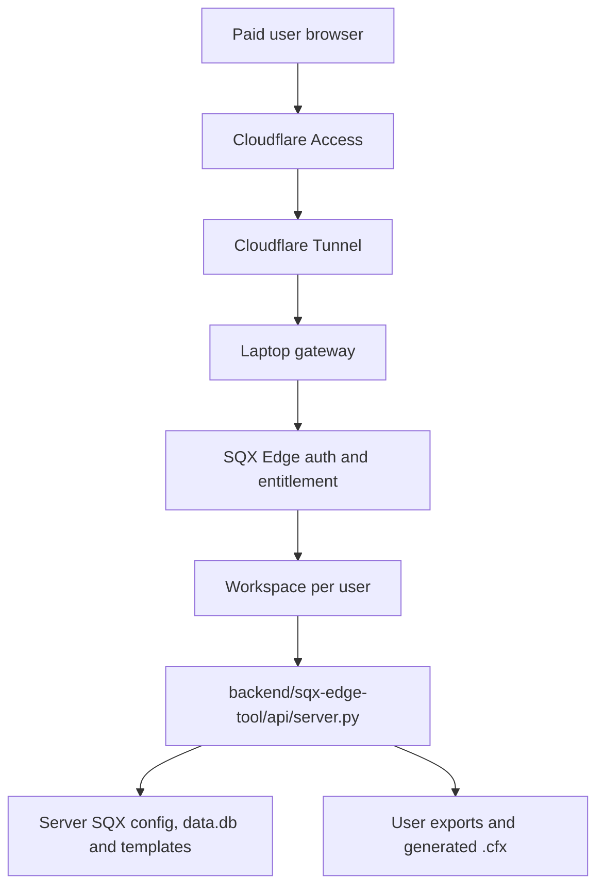

# SQX Edge Architecture

Final architecture map and load order after the modularization phases.

## Runtime Shape

SQX Edge Suite is moving to `remote_service` as the primary product shape:

- The final user opens a protected web link, validates email and uses the app in the browser with no local installation.
- Cloudflare Access plus Cloudflare Tunnel protect the public edge and route traffic to the operator laptop during the pilot.
- A laptop-hosted gateway talks to the SQX Edge backend and assigns every request to a server-derived workspace per user.
- SQX paths, `data.db`, templates, BlockSettings and generated artifacts live on the server side.
- The existing local Flask API, dashboard scripts and portable package remain the technical base and internal fallback, but portable ZIP is no longer the commercial user-facing flow.

Current implementation base:

- The dashboard still runs from `app/SQX_Dashboard_v6.html`.
- Frontend behavior is loaded through plain browser scripts, without a bundler.
- Shared frontend namespaces live under `window.SQX`.
- The Project Generator tab currently talks to the Python API at `http://127.0.0.1:5050`; REMOTE phases will transition this boundary from `local_only` to `remote_tunnel_only`.
- The active pilot host remains the Windows laptop because SQX resources, `data.db`, templates, PowerShell runbooks and compatibility diagnostics are already aligned there.
- Docker/Linux is a future hardening option, not an active deployment requirement for testers or buyers.

## Top-Level Map

```mermaid
flowchart TD
  H["app/SQX_Dashboard_v6.html"] --> CSS["app/css/dashboard.css"]
  H --> DATA["Static data scripts"]
  H --> MOD["app/js/modules/*"]
  H --> LEG["Legacy-compatible render layer"]
  H --> INIT["App init scripts"]

  DATA --> HD["historical-data.js"]
  DATA --> SD["scores-data.js"]
  DATA --> MD["manifest-data.js"]
  DATA --> CFG["app-config.js"]

  MOD --> CORE["core.js"]
  MOD --> FEAT["domain/renderers/charts/strategies/home/state backup/MTF evidence/Champion vs Challenger/Strategy Builder/support/fulfillment/customer cockpit/workflow/view creator"]
  MOD --> PG["project-generator-* modules"]
  MOD --> IDX["index.js boot"]

  LEG --> DJ["data.js"]
  LEG --> DASH["dashboard.js"]

  INIT --> MAIN["main.js"]
  INIT --> PGM["project-generator-main.js"]

  PGM --> API["backend/sqx-edge-tool/api/server.py"]
  API --> COREPY["backend/sqx-edge-tool/core/*"]
  API --> RELAYIN["Relay ingest endpoint"]
  COREPY --> CONFIG["backend/sqx-edge-tool/config/*.json"]
  COREPY --> TPL["backend/sqx-edge-tool/templates/*.cfx"]
  RELAY["backend/sqx-edge-relay/api/server.py"] --> RELAYQ["backend/sqx-edge-relay/core/relay_queue.py"]
  RELAY --> RELAYS["backend/sqx-edge-relay/core/relay_settings.py"]
  RELAY --> RELAYOBS["backend/sqx-edge-relay/core/relay_observability.py"]
  RELAYW["backend/sqx-edge-relay/worker/dispatch_worker.py"] --> RELAYQ
  RELAYW --> RELAYS
  RELAYSIM["backend/sqx-edge-relay/tools/simulate_purchase_flow.py"] --> RELAYQ
  RELAYSIM --> RELAYOBS
  RELAYDEPLOY["backend/sqx-edge-relay/tools/deployment_check.py"] --> RELAYS
  RENDERAPI["backend/sqx-edge-relay/tools/render_api_preflight.py"] --> RENDER["Render API"]
  RENDERHANDSHAKE["backend/sqx-edge-relay/tools/render_credentials_handshake.py"] --> RENDERAPI
  RENDERGATE["backend/sqx-edge-relay/tools/render_staging_gate.py"] --> RENDERHANDSHAKE
  RENDERGATE --> RELAYEVIDENCE
  RENDERLAUNCH["backend/sqx-edge-relay/tools/render_staging_launch_pack.py"] --> RENDERGATE
  RENDERLAUNCH --> RENDERBLUEPRINT["backend/sqx-edge-relay/deploy/render.staging.yaml.example"]
  RENDERSECRETS["backend/sqx-edge-relay/tools/render_staging_secrets_kit.py"] --> RENDERGATE
  RENDERSECRETS --> RENDERDATA["backend/sqx-edge-relay/data/render_staging_secrets_kit"]
  LOCALINGESTLAUNCH["backend/sqx-edge-relay/tools/local_ingest_tunnel_launcher.py"] --> LOCALINGESTCHECK
  LOCALINGESTSESSION["backend/sqx-edge-relay/tools/local_ingest_staging_session.py"] --> LOCALINGESTLAUNCH
  LOCALINGESTSESSION --> LOCALINGESTCHECK
  LOCALINGESTHANDOFF["backend/sqx-edge-relay/tools/local_ingest_render_handoff.py"] --> LOCALINGESTSESSION
  RENDERAPPLY["backend/sqx-edge-relay/tools/render_staging_apply_gate.py"] --> LOCALINGESTHANDOFF
  RENDERAPPLY --> RENDERGATE
  RENDERPURCHASE["backend/sqx-edge-relay/tools/render_staging_purchase_drill.py"] --> RENDERAPPLY
  RENDERPURCHASE --> RELAY
  LOCALINGESTCHECK["backend/sqx-edge-relay/tools/local_ingest_tunnel_check.py"] --> RELAYIN
  RELAYSTAGE["backend/sqx-edge-relay/tools/staging_smoke.py"] --> RELAY
  RELAYEVIDENCE["backend/sqx-edge-relay/tools/staging_evidence.py"] --> RELAYSTAGE
  RELAYEVIDENCE --> RELAYDEPLOY
  RELAY --> RELAYIN
```

## Remote Service Target Map

Remote-service invariants:

- Browser payloads cannot select arbitrary local paths, user ids or workspace ids.
- Payment entitlement and validated email are checked before user-facing Pro access.
- REMOTE-3C payment webhooks use `remote-payment-webhook-v1`, `SQX_REMOTE_PAYMENT_WEBHOOK_SECRET`, exact-body HMAC verification and idempotent `processedWebhookEvents` before changing paid access.
- Every mutable action writes an audit event with user, workspace, action, artifact and timestamp.
- The laptop backend is never published directly; public traffic must enter through Cloudflare Access/Tunnel.

REMOTE-1 laptop server baseline:

- `tools/remote_service_preflight.ps1` validates local server readiness, SQX paths, `data.db`, templates and output without opening a public surface.
- `tools/remote_service_start_server.ps1` starts `backend/sqx-edge-tool/api/server.py` on `127.0.0.1:5050` only.
- `tools/remote_service_watchdog.ps1` supervises `/api/health` and logs to ignored `.local/remote_service/`.
- `tools/remote_service_install_startup_task.ps1` registers the watchdog in Windows Task Scheduler when the operator explicitly runs it.
- REMOTE-2 is the first phase allowed to add Cloudflare Tunnel/domain exposure; REMOTE-1 remains local-only.

REMOTE-2 Cloudflare Tunnel and Access:

- `tools/remote_tunnel_preflight.ps1` checks Cloudflare Tunnel readiness, private evidence, REMOTE-1 readiness and that the target remains `http://127.0.0.1:5050`.
- `tools/remote_tunnel_run.ps1` runs `cloudflared` from ignored local config only after preflight GO.
- `tools/remote_tunnel_smoke.ps1` verifies anonymous traffic is blocked by Cloudflare Access before any SQX Edge body is visible.
- `tools/remote_tunnel_install_startup_task.ps1` can register the tunnel runner in Windows Task Scheduler.
- `docs/examples/remote_tunnel.local.example.json` defines the redacted boolean evidence shape copied into ignored `.local/remote_service/cloudflare_tunnel.local.json`.

REMOTE-3C paid webhook and protected write pilot:

- `backend/sqx-edge-tool/core/remote_payments.py` owns signed payment event normalization, idempotent paid entitlement upserts and redacted audit records.
- `POST /api/remote/payment/webhook` accepts only signed raw bodies and writes `paid_subscription` changes to the ignored local entitlement store.
- `POST /api/remote/protected/write-pilot` proves app-session write enforcement without mutating project state; real workspace writes begin in REMOTE-4.

REMOTE-SUG1 deployment hardening decision:

- The tester proposal validates our zero-ingress direction: no router ports, Cloudflare Tunnel only, Cloudflare Access before app body and no provider secrets in Git.
- Its backup, persistence, restart and energy-management ideas reinforce REMOTE-1/2 runbooks.
- Root Docker/Ubuntu deployment is deferred to REMOTE-9 because current SQX resource access is Windows-centered.
- The core app must not gain a root `Dockerfile`, root `docker-compose.yml` or root `.dockerignore` until SQX compatibility, workspaces and backup/restore are proven.

REMOTE-9 future containerization:

- Option A: Linux/Docker hosts the web backend while a Windows worker owns SQX resources.
- Option B: Docker hosts only sanitized backend resources after SQX dependencies are abstracted away.
- Both options require explicit compatibility tests for `data.db`, templates, `.cfx` output paths, workspace persistence and protected write endpoints.

## Frontend Load Order

The exact script order is contract-tested in `backend/sqx-edge-tool/test_dashboard_static.py`.

1. `js/historical-data.js`
2. `js/scores-data.js`
3. `js/manifest-data.js`
4. `js/app-config.js`
5. `js/modules/core.js`
6. `js/modules/config.js`
7. `js/modules/storage.js`
8. `js/modules/modal-registry.js`
9. `js/modules/state-backup.js`
10. `js/modules/license.js`
11. `js/modules/ui.js`
12. `js/modules/formatters.js`
13. `js/modules/champion-challenger-core.js`
14. `js/modules/domain.js`
15. `js/modules/datasets.js`
16. `js/modules/champion-challenger-regime.js`
17. `js/modules/champion-challenger.js`
18. `js/modules/strategy-builder-core.js`
19. `js/modules/strategy-builder.js`
20. `js/modules/renderers.js`
21. `js/modules/charts.js`
22. `js/modules/strategies.js`
23. `vendor/jszip.min.js`
24. `js/modules/exit-policy.js`
25. `js/modules/template-maker.js`
26. `js/modules/template-maker-ui.js`
27. `js/modules/home.js`
28. `js/modules/mtf-evidence.js`
29. `js/modules/support.js`
30. `js/modules/fulfillment.js`
31. `js/modules/customer-cockpit.js`
32. `js/modules/workflow.js`
33. `js/modules/view-creator.js`
34. `js/modules/project-generator-core.js`
35. `js/modules/project-generator-config.js`
36. `js/modules/project-generator-dom.js`
37. `js/modules/project-generator-bindings.js`
38. `js/modules/project-generator-renderers.js`
39. `js/modules/project-generator-status.js`
40. `js/modules/project-generator-cleaner.js`
41. `js/modules/project-generator.js`
42. `js/modules/index.js`
43. `js/data.js`
44. `js/dashboard.js`
45. `js/main.js`
46. `js/project-generator-main.js`

## Why This Order Matters

- Data scripts load first because legacy-compatible render code still consumes global datasets.
- `app-config.js` loads before modules so API base and feature options are available everywhere.
- `modules/core.js` creates `window.SQX`, module registration, and ready callbacks.
- Focused modules attach stable contracts under `window.SQX`.
- `modal-registry.js` loads before state backup and dashboard actions so critical decisions can use a traceable shared modal instead of blind native prompts.
- `champion-challenger-regime.js` loads after `datasets.js` because it adapts first-party historical and score evidence.
- `strategy-builder-core.js` and `strategy-builder.js` load after Champion vs Challenger so the Builder can consume the reduced J6 handoff shape without coupling to raw CSV; SQX Views handoff is resolved at click time through the later `view-creator.js` runtime contract.
- `vendor/jszip.min.js` loads before Template Maker because local/offline `.sqx` parsing and C2 export cannot depend on a CDN.
- `exit-policy.js` loads before Template Maker so C2 generation can detect, disable or randomize SQX exit methods through one global policy.
- `template-maker.js` and `template-maker-ui.js` replace the old active analyzer surface with a native SQX module for Capa 1/2 scoring and C2 generation.
- `modules/index.js` marks the module layer as booted and flushes ready callbacks.
- `data.js` and `dashboard.js` preserve existing global render functions and dashboard behavior.
- `main.js` runs shell-level initial rendering and workflow initialization.
- `project-generator-main.js` runs last because it binds DOM events and calls the backend through the Project Generator module contracts.

## Frontend Module Responsibilities

| File | Responsibility |
| --- | --- |
| `modules/core.js` | SQX namespace, module registry, ready queue, shared guards. |
| `modules/config.js` | Central access to UI/config manifests and dynamic values. |
| `modules/storage.js` | Local state persistence, safe JSON access, strategy state. |
| `modules/modal-registry.js` | Registry of active modals, user-visible trace helpers and the shared decision modal for critical reset/delete/import/restore actions. |
| `modules/state-backup.js` | Dashboard local-state snapshot and restore UI against the local backup API, limited to non-sensitive localStorage keys. |
| `modules/ui.js` | Shared DOM/UI helpers and tab helpers. |
| `modules/formatters.js` | Display formatting, escaping, labels, badges. |
| `modules/champion-challenger-core.js` | Pure CSV parsing, alias resolution, Champion vs Challenger comparison, OOS stability/timeline helpers, direction detection and edge archetype classification. |
| `modules/domain.js` | Domain rules that are independent from DOM rendering. |
| `modules/datasets.js` | Normalized access to asset, score and manifest datasets. |
| `modules/champion-challenger-regime.js` | First-party Regime/EGT evidence adapter for Champion vs Challenger using historical and score datasets, including `short_only`, `OK_MEAN_REVERT` and volatility coherence. |
| `modules/champion-challenger.js` | Native dashboard UI facade for `tab-cvc`, delegating parsing, scoring, contextual evidence, safe JSON export and internal handoff contracts without local persistence. |
| `modules/strategy-builder-core.js` | Pure read-only Strategy Builder package builder for local `sqx-edge.strategy-builder-package` previews, import validation, re-review gating, review summaries, buyer workflow summaries, visible audit entries, Project Generator prefill/preset draft mapping, SQX Views validation-pack handoff mapping, Strategy Cleaner draft mapping, unified buyer handoff packs, buyer pack import reviews, guided buyer session checklists, redacted buyer session summaries, printable operator notes, local support-case bundles and support resolution checklists. |
| `modules/strategy-builder.js` | Native dashboard UI facade for `tab-strategybuilder`, building local previews plus gated JSON import/export, visible review checklist, session-only handoff audit trail, Project Generator custom/preset prefill, SQX Views handoff, Strategy Cleaner draft handoff, preview-only buyer packs, buyer pack import reviews, buyer session checklists, local redacted buyer summary exports, printable operator notes, support-case bundles and support resolution checklists without backend calls or generated trading logic. |
| `modules/renderers.js` | Reusable HTML rendering helpers for dashboard lists/tables. |
| `modules/charts.js` | Chart and visual summary helpers. |
| `modules/strategies.js` | Strategy UI contracts, deletion/import state, strategy metadata. |
| `modules/exit-policy.js` | Global SQX exit-method policy for detecting exit params, disabling non-methodological exits and randomizing allowed C2 exits before export. |
| `modules/home.js` | Inicio tab model, trace and summary helpers. |
| `modules/mtf-evidence.js` | Read-only MTF evidence panel that consumes `/api/mtf/evidence` and only surfaces A56 GO summaries. |
| `modules/support.js` | Safe support diagnostics download from the local API. |
| `modules/fulfillment.js` | Internal operator queue cockpit for manual fulfillment states and retries. |
| `modules/customer-cockpit.js` | Redacted customer success cockpit for Pro renewal, support and expansion state. |
| `modules/workflow.js` | Workflow tab initialization and subtab behavior. |
| `modules/view-creator.js` | Native SQX `.vw` generator for annual Databank views, EGT/Robustez/Template Maker/CVC Decision Cert presets, saved local presets, JSON preset packs with import preview, workflow handoffs and XML downloads. This is the maintained replacement for the archived Tkinter staging prototype. |
| `modules/project-generator-core.js` | Project Generator shared helpers and API primitives. |
| `modules/project-generator-config.js` | Project Generator config read/write helpers, enriched starter custom profiles, profile-family packs, local custom preset persistence, import preview and portable custom preset JSON packs. |
| `modules/project-generator-dom.js` | Project Generator DOM helpers, config inputs, custom project inputs, settings panel and log output. |
| `modules/project-generator-bindings.js` | Project Generator event bindings and polling wiring. |
| `modules/project-generator-renderers.js` | Project Generator DOM render output helpers. |
| `modules/project-generator-status.js` | Project Generator health/status, custom generation result and polling helpers. |
| `modules/project-generator-cleaner.js` | Strategy cleaner helpers used by Project Generator. |
| `modules/project-generator.js` | Public Project Generator facade that composes the split modules. |
| `modules/index.js` | Module boot marker and final module-order registry. |

## Initialization Scripts

| File | Responsibility |
| --- | --- |
| `data.js` | Compatibility layer for static dashboard data. |
| `dashboard.js` | Existing dashboard render functions and tab behavior. |
| `main.js` | First render pass for Inicio, assets, categories, filters, priority, strategies, pipeline, Champion vs Challenger, Strategy Builder and workflow. |
| `project-generator-main.js` | Project Generator orchestration, DOM bindings, backend calls and polling. |

## Backend Map

| Path | Responsibility |
| --- | --- |
| `backend/sqx-edge-tool/api/server.py` | Flask API, health, config, plan/custom generation, backup and strategy endpoints. |
| `backend/sqx-edge-tool/core/project_generator.py` | Project generation flow and SQX project assets, including optional custom project names. |
| `backend/sqx-edge-tool/core/strategy_cleaner.py` | Strategy cleaning and deletion support. |
| `backend/sqx-edge-tool/core/config_loader.py` | Config loading and defaults. |
| `backend/sqx-edge-tool/core/sqx_db.py` | SQX database verification and access helpers. |
| `backend/sqx-edge-tool/core/support_diagnostics.py` | Redacted support diagnostics payload builder. |
| `backend/sqx-edge-tool/core/mtf_evidence.py` | Read-only A56 MTF evidence summarizer for dashboard use, redacting full paths and blocking non-GO reports. |
| `backend/sqx-edge-tool/core/customer_cockpit.py` | Redacted commercial customer cockpit aggregation from local success evidence. |
| `backend/sqx-edge-tool/core/fulfillment_normalizer.py` | Shared Lemon Squeezy normalization and signature verification. |
| `backend/sqx-edge-tool/core/fulfillment_queue.py` | Persistent fulfillment queue, operator status, trusted relay ingest and retry tracking. |
| `backend/sqx-edge-tool/tools/plan_quality_advisor.py` | Data-informed review of the current mining plan against dashboard scores with diversified candidate recommendations and optional multi-timeframe evidence. |
| `backend/sqx-edge-tool/tools/first_party_metric_source.py` | First-party H1 metric bundle builder that normalizes `app/js/scores-data.js` into `asset_metrics.json`, writes provenance and validates with the metric gate without synthetic TFs. |
| `backend/sqx-edge-tool/tools/multi_timeframe_source_intake.py` | Controlled intake gate for real H1/M30/M15/H4 metric folders with optional first-party H1 generation and strict blocking for missing synthetic lower/higher TFs. |
| `backend/sqx-edge-tool/tools/multi_timeframe_plan_artifacts.py` | Guarded A54 artifact generator that runs A53, writes intake reports, and only produces Plan Quality Advisor MTF artifacts when intake status is GO. |
| `backend/sqx-edge-tool/tools/ohlc_metric_builder.py` | A55 market-data bridge that converts reviewable operator-supplied OHLC CSV files into `asset_metrics[_TF].json` files for the MTF pipeline. |
| `backend/sqx-edge-tool/tools/real_mtf_pipeline_run.py` | A56 end-to-end runner for real OHLC CSV inputs through metric building, source intake and guarded plan artifacts. |
| `backend/sqx-edge-tool/tools/dukas_mt5_ohlc_download.py` | A58 internal MT5/Dukascopy downloader that writes reviewable OHLC CSVs for A55/A56, with coverage reports and optional MetaTrader5 dependency. |
| `backend/sqx-edge-tool/config/dukas_mt5_download.json` | A58 operator config for terminal path, assets, mapped MT5 symbols, timeframes, output paths and portable exclusion policy. |
| `backend/sqx-edge-tool/tools/multi_timeframe_scoring.py` | Dependency-isolated scoring tool that converts supplied `asset_metrics[_TF].json` files into per-timeframe scores and weighted multi-timeframe consensus. |
| `backend/sqx-edge-tool/tools/multi_timeframe_metric_gate.py` | First-party metric intake gate for supplied `asset_metrics[_TF].json` folders with coverage, completeness, unknown-asset checks, scoring compatibility and SHA256 traceability. |
| `backend/sqx-edge-tool/config/multi_timeframe_source_policy.json` | A53 GO/NO-GO policy for required timeframes, accepted metric filenames, minimum coverage/completeness and no-synthetic-TF rules. |
| `backend/sqx-edge-tool/config/ohlc_metric_source_policy.json` | A55 CSV source policy for accepted OHLC columns, file naming, supported timeframes, minimum bars and no-synthetic-TF rules. |
| `backend/sqx-edge-tool/config/real_mtf_pipeline_run.json` | A56 run policy for default OHLC input/output paths, expected asset coverage mode and no-data GO/NO-GO behavior. |
| `backend/sqx-edge-tool/tools/checkout_live_readiness.py` | Checkout live readiness gate for Lemon URLs, variants, support email, staging evidence and rollback. |
| `backend/sqx-edge-tool/tools/commercial_release_candidate.py` | Commercial RC gate for portable ZIP, SHA256, readiness evidence, pilot purchase and rollback. |
| `backend/sqx-edge-tool/tools/pilot_purchase_kit.py` | Private pilot purchase kit for checkout order, signed Pro license, customer delivery and import evidence. |
| `backend/sqx-edge-tool/tools/limited_public_launch.py` | Limited public launch gate for pilot evidence, checkout, first sale cap, support inbox and rollback owner. |
| `backend/sqx-edge-tool/tools/post_launch_control.py` | Post-launch control gate for first sales, activations, support tickets, refunds and scale decision evidence. |
| `backend/sqx-edge-tool/tools/commercial_feedback_loop.py` | Commercial feedback gate for issue classification, pricing, copy, planned version and release notes evidence. |
| `backend/sqx-edge-tool/tools/public_offer_pack.py` | Public offer gate for controlled copy, FAQ, release notes, buyer steps, checkout and safe claims evidence. |
| `backend/sqx-edge-tool/tools/launch_assets_kit.py` | Launch assets gate for ZIP, SHA256, screenshots, copy, release draft and publication checklist evidence. |
| `backend/sqx-edge-tool/tools/public_release_gate.py` | Public release gate for tag, GitHub Release, ZIP attachment, SHA256 publication, support and rollback evidence. |
| `backend/sqx-edge-tool/tools/release_publication_record.py` | Post-publication record for published tag/release, ZIP checksum, download test, support window and rollback evidence. |
| `docs/R45_CONTROLLED_PUBLICATION_PLAN.md` | Public-safe publication plan for the verified ZIP, including draft notes, gate command, post-publication record command and rollback boundary. |
| `backend/sqx-edge-tool/tools/post_release_monitor.py` | Post-release monitor for downloads, sales, activations, support tickets, incidents, refunds, hotfix and scale decision evidence. |
| `backend/sqx-edge-tool/tools/hotfix_rollback_release.py` | Hotfix/rollback release kit for incident action, owner, notes, customer comms, verification and closure evidence. |
| `backend/sqx-edge-tool/tools/pro_buyer_pack.py` | Internal validator for buyer-facing Pro data/templates before packaging. |
| `backend/sqx-edge-tool/tools/buyer_onboarding_support_gate.py` | Internal buyer handoff gate for purchase, ZIP, license, START_HERE, FAQ, support contact and safe claims. |
| `backend/sqx-edge-tool/tools/template_pack_1_delivery.py` | Internal validator and packager for Template Pack 1 add-on delivery. |
| `backend/sqx-edge-tool/tools/template_pack_1_offer.py` | Internal gate for Template Pack 1 public add-on offer copy, checkout draft and delivery/support macros. |
| `backend/sqx-edge-tool/tools/template_pack_1_publication.py` | Internal gate for Template Pack 1 real checkout values and controlled publication. |
| `backend/sqx-edge-tool/tools/template_pack_1_purchase_drill.py` | Internal gate for Template Pack 1 controlled purchase, payment, delivery and support evidence. |
| `backend/sqx-edge-tool/tools/template_pack_1_handoff.py` | Internal gate for Template Pack 1 post-purchase handoff, support and scale/pause evidence. |
| `backend/sqx-edge-tool/tools/template_pack_1_sales_register.py` | Internal register for Template Pack 1 add-on sales, delivery, support, refunds, fulfillment and scale decision evidence. |
| `backend/sqx-edge-tool/tools/template_pack_1_feedback_cohort.py` | Internal cohort review for Template Pack 1 buyer feedback, support, refunds, positive signals and roadmap decision evidence. |
| `backend/sqx-edge-tool/tools/template_pack_1_action_plan.py` | Internal action-plan gate for Template Pack 1 offer iteration, traffic expansion, Template Pack 2 specs or pause/fix next phase. |
| `backend/sqx-edge-tool/tools/template_pack_2_specs.py` | Internal specs gate for Template Pack 2 scope, asset families, presets, support boundaries, delivery model and next phase. |
| `backend/sqx-edge-tool/tools/template_pack_2_assets.py` | Internal asset gate and add-on packager for Template Pack 2 profiles, presets, support boundaries and safe-claims checks. |
| `backend/sqx-edge-tool/tools/template_pack_2_offer_pack.py` | Internal offer-pack gate for Template Pack 2 copy, FAQ, checkout draft, delivery macro, support macro and live-checkout readiness. |
| `backend/sqx-edge-tool/tools/template_pack_2_publication.py` | Internal controlled-publication gate for Template Pack 2 checkout URL, provider variant, support inbox, rollback and purchase-drill readiness. |
| `backend/sqx-edge-tool/tools/template_pack_2_purchase_drill.py` | Internal purchase-drill gate for Template Pack 2 redacted order, payment, add-on delivery, support and refund/pause evidence. |
| `backend/sqx-edge-tool/tools/template_pack_2_handoff.py` | Internal post-purchase handoff gate for Template Pack 2 delivery, support, first value and scale/hold/pause evidence. |
| `backend/sqx-edge-tool/tools/template_pack_2_sales_register.py` | Internal sales-register gate for Template Pack 2 redacted sales, delivery, support, refunds, fulfillment failures and scale decision evidence. |
| `backend/sqx-edge-tool/tools/template_pack_2_feedback_cohort.py` | Internal feedback-cohort gate for Template Pack 2 aggregated feedback, support, refunds, positive signals and roadmap decision evidence. |
| `backend/sqx-edge-tool/tools/buyer_ready_checkout_closeout.py` | Internal buyer-ready closeout gate for checkout, release, license delivery, support, rollback and first controlled sales evidence. |
| `backend/sqx-edge-tool/tools/public_buyer_page_cadence.py` | Internal public buyer page and first-sale cadence gate for controlled publication evidence. |
| `backend/sqx-edge-tool/tools/first_controlled_buyer_log.py` | Internal first controlled buyer operating log gate for activation, support, feedback and post-sale decision evidence. |
| `backend/sqx-edge-tool/tools/post_sale_improvement_loop.py` | Internal post-sale improvement gate for onboarding, support macro, public copy and safe-claims micro-updates. |
| `backend/sqx-edge-tool/tools/post_sale_micro_updates.py` | Internal gate that verifies applied buyer-facing micro-updates and next controlled buyer readiness. |
| `backend/sqx-edge-tool/tools/next_controlled_buyer_readiness.py` | Internal gate before sharing another private checkout link with one controlled buyer. |
| `backend/sqx-edge-relay/api/server.py` | Deployable remote relay service for Lemon webhooks, queue inspection and dispatch. |
| `backend/sqx-edge-relay/core/relay_queue.py` | Remote relay queue, signed bundle dispatch and requeue logic. |
| `backend/sqx-edge-relay/core/relay_settings.py` | Relay environment settings, config readiness and operator token checks. |
| `backend/sqx-edge-relay/core/relay_observability.py` | JSONL relay events, redaction and queue snapshots. |
| `backend/sqx-edge-relay/worker/dispatch_worker.py` | Supervised relay dispatch loop for pending bundles. |
| `backend/sqx-edge-relay/tools/simulate_purchase_flow.py` | Local purchase flow simulation for relay observability checks. |
| `backend/sqx-edge-relay/tools/deployment_check.py` | Production preflight for files, Docker readiness and required secrets. |
| `backend/sqx-edge-relay/tools/render_api_preflight.py` | Render API preflight for API key, owner ID and Blueprint validation. |
| `backend/sqx-edge-relay/tools/staging_smoke.py` | Remote staging smoke test for health, config, observability, snapshot and signed webhook. |
| `backend/sqx-edge-relay/tools/staging_evidence.py` | Staging evidence collector that writes GO/NO-GO reports in JSON and Markdown. |
| `backend/sqx-edge-relay/tools/render_staging_apply_gate.py` | Final Render staging apply gate for local ingest handoff confirmation and remote GO evidence. |
| `backend/sqx-edge-relay/tools/render_staging_purchase_drill.py` | Render staging purchase drill for webhook, queue and dispatch evidence. |
| `backend/sqx-edge-relay/deploy/*` | Docker Compose, provider examples and systemd deployment templates. |
| `backend/sqx-edge-tool/config/*.json` | Dynamic catalogs for assets, instruments, profiles, plan and UI manifest. |
| `backend/sqx-edge-tool/templates/*.cfx` | StrategyQuant template files used by generation. |
| `resources/pro-buyer-pack/*` | Buyer-facing Pro starter data, CSV import template, onboarding, activation/support checklists and first-value material. |
| `resources/pro-template-pack-1/*` | Buyer-facing add-on source and public offer draft for Template Pack 1, packaged separately from the base portable ZIP. |

## Internal Fallback Packaging

Portable packaging is owned by `backend/sqx-edge-tool/tools/package_portable.ps1` and remains an internal fallback/rollback path during the remote-service pivot. It is not the final-user commercial onboarding flow unless explicitly re-approved.

The package includes:

- `START_SQX_EDGE.bat` and `STOP_SQX_EDGE.bat` at package root.
- `packaging/START_SQX_EDGE.bat` and `packaging/STOP_SQX_EDGE.bat` as source launchers.
- `app/` dashboard assets.
- `backend/sqx-edge-tool/` API, core code, templates, config templates and embedded runtime.
- `backend/sqx-edge-tool/runtime/python/python.exe`.
- `resources/pro-buyer-pack/` buyer-facing starter and onboarding material.

The package excludes:

- `.git`
- `venv`
- `output`
- `analysis_output`
- `dist`
- `backups`
- `node_modules`
- `.pytest_cache`
- downloaded runtime cache
- local `backend/sqx-edge-tool/config.json`
- internal MT5/Dukascopy downloader, config, `data/ohlc/`, all `analysis_output/` evidence and A56/A58/A61/A62 generated run output
- `resources/pro-template-pack-1/` because Template Pack 1 is a separate paid add-on delivery.

## Contract Tests

The architecture is protected by two layers:

- `tests/js/module_contracts.mjs` imports granular browser-module contracts.
- `backend/sqx-edge-tool/test_dashboard_static.py` verifies static HTML structure, script order, file existence, packaging rules and frontend contracts.

When changing load order or module boundaries, update both the implementation and the matching contracts in the same phase.

## Future Change Rules

- Keep `modules/core.js` first among modules.
- Keep `modules/index.js` after all module files and before legacy-compatible scripts.
- Keep `project-generator-main.js` last unless Project Generator orchestration is converted into a boot callback.
- Do not make a module depend on a script loaded later.
- Prefer adding narrow contracts before moving behavior across files.
- Any new visible tab, panel, module or manifest-driven UI state must update the architecture map, load-order or module-responsibility table, JS contracts and E2E smoke expectations in the same phase.
- Keep remote-service validation aligned with Cloudflare Tunnel, paid auth and workspace isolation.
- Keep fallback packaging validation aligned with the internal portable flow when packaging files change.
