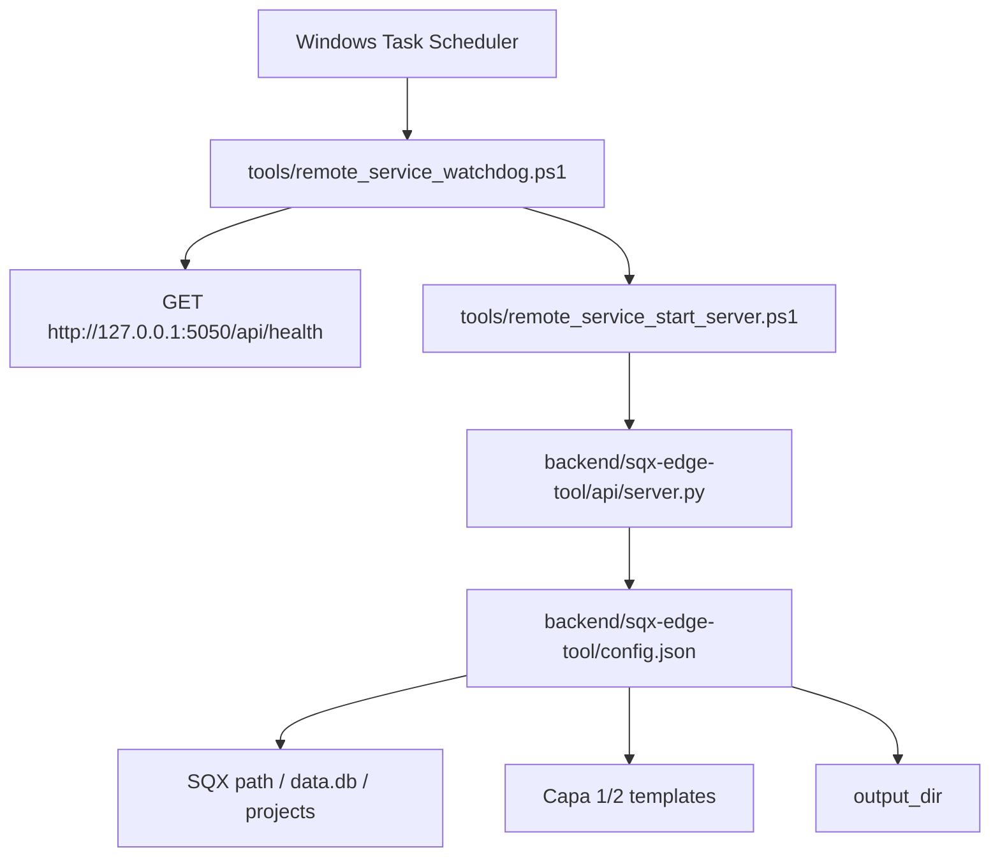

# REMOTE-1 - Laptop Server Baseline

## Summary

REMOTE-1 convierte el portatil del operador en una base de servidor controlado para el futuro acceso web Pro. Esta fase no publica URLs, no crea tuneles, no abre puertos y no toca Cloudflare. Solo deja listo un arranque local supervisado, validacion de rutas SQX y watchdog.

## Operating Model



The API remains bound to `127.0.0.1`. REMOTE-2 will put Cloudflare Tunnel in front of this local service. Until then, the laptop is a local server baseline only.

## Added Tools

- `tools/remote_service_preflight.ps1`: validates repo, API boundary, runtime, config, templates, output, SQX paths and optional strict SQX readiness.
- `tools/remote_service_start_server.ps1`: starts the Flask backend on `127.0.0.1:5050` only.
- `tools/remote_service_watchdog.ps1`: checks `/api/health`, starts the backend if needed and writes local ignored logs to `.local/remote_service/watchdog.log`.
- `tools/remote_service_install_startup_task.ps1`: optionally registers the watchdog in Windows Task Scheduler.

## Operator Commands

Basic preflight without requiring SQX paths to be fully configured:

```powershell
powershell -NoProfile -ExecutionPolicy Bypass -File tools\remote_service_preflight.ps1
```

Strict preflight before allowing a remote pilot:

```powershell
powershell -NoProfile -ExecutionPolicy Bypass -File tools\remote_service_preflight.ps1 -RequireSqxReady
```

One-shot watchdog smoke without starting anything:

```powershell
powershell -NoProfile -ExecutionPolicy Bypass -File tools\remote_service_watchdog.ps1 -Once -NoStart
```

Start the local backend under REMOTE-1 constraints:

```powershell
powershell -NoProfile -ExecutionPolicy Bypass -File tools\remote_service_start_server.ps1
```

Operator-friendly remote start, including visual Backend/Tunnel monitor, is owned by REMOTE-RUNBOOK1:

```bat
START_SQX_EDGE_REMOTE.bat
```

Register the watchdog for the current user at logon:

```powershell
powershell -NoProfile -ExecutionPolicy Bypass -File tools\remote_service_install_startup_task.ps1
```

Register it at machine startup when the operator deliberately wants that mode and has the needed Windows permissions:

```powershell
powershell -NoProfile -ExecutionPolicy Bypass -File tools\remote_service_install_startup_task.ps1 -AtStartup
```

## Readiness Checks

REMOTE-1 is ready when:

- `/api/health` is reachable on `127.0.0.1:5050`.
- `config.json` exists and is readable.
- `sqx_path`, `sqx_data_db` and `sqx_projects_dir` point to the server-side SQX installation.
- Capa 1 and Capa 2 templates exist.
- `output_dir` exists and is writable by the backend user.
- The watchdog can restart the backend without changing the public network surface.

## Security Boundary

- No public ports are opened in REMOTE-1.
- The backend must stay bound to `127.0.0.1` or `localhost`.
- Browser users must never provide local paths, SQX paths or workspace ids.
- `.local/remote_service/` is local-only operational evidence and remains ignored.
- Cloudflare Tunnel, Access policy and domain wiring are blocked until REMOTE-2.

## Handoff To REMOTE-2

REMOTE-2 can begin only after the strict preflight proves server-side SQX readiness and the watchdog is operational. REMOTE-2 will add Cloudflare Tunnel and external protection; it must not weaken the localhost-only backend boundary.
