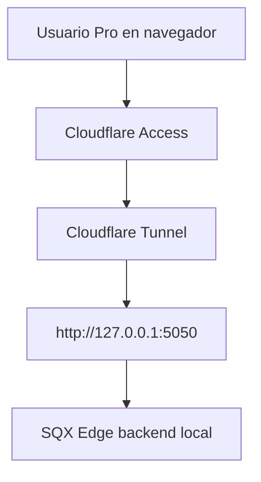

# REMOTE-2 - Cloudflare Tunnel And Access

## Summary

REMOTE-2 pone una frontera Cloudflare delante del servidor local REMOTE-1 sin abrir puertos del router. La ruta objetivo es:



Esta fase prepara y valida el camino de dominio + Tunnel + Access. Los valores privados quedan fuera de Git: hostname, zone id, account id, tunnel id, Access app id, policy id, tokens, emails y URLs reales.

## Current Public-Safe Status

Status: `GO_REMOTE2_TUNNEL_ACCESS_READY_NO_GIT_LEAK`.

Validated on 2026-05-17:

- anonymous traffic is redirected to Cloudflare Access before any SQX Edge body is visible;
- an approved identity can complete Access authentication and load the remote dashboard;
- the backend still rejects public-host requests that do not carry the trusted Access identity header;
- private hostname, account, tunnel, policy and user evidence stays only in ignored local files.

## Added Tools

- `tools/remote_tunnel_preflight.ps1`: valida `cloudflared`, REMOTE-1, target local, evidencia privada ignorada y que Access/Tunnel estan listos.
- `tools/remote_tunnel_operator_handoff.ps1`: genera instrucciones privadas locales y plantilla de config ignorada para terminar login, tunel, ruta DNS y Access sin filtrar datos al repo.
- `tools/remote_tunnel_run.ps1`: arranca el tunel con config local ignorada solo si el preflight devuelve GO.
- `tools/remote_tunnel_smoke.ps1`: prueba anonima contra la URL protegida y espera que Cloudflare Access bloquee antes de exponer cuerpo de app.
- `tools/remote_tunnel_install_startup_task.ps1`: registra el tunel en Windows Task Scheduler cuando el operador lo decida.
- `docs/examples/remote_tunnel.local.example.json`: plantilla publica segura para crear `.local/remote_service/cloudflare_tunnel.local.json`.
- `docs/examples/cloudflared-config.local.example.yml`: plantilla publica segura para crear `.local/remote_service/cloudflared-config.local.yml`.

## Private Evidence File

Copy:

```text
docs/examples/remote_tunnel.local.example.json
```

to:

```text
.local/remote_service/cloudflare_tunnel.local.json
```

Only booleans are needed. Do not paste real hostnames, emails, account IDs, tunnel IDs, Access IDs, tokens, screenshots or URLs into tracked files.

## Operator Sequence

1. Confirm REMOTE-1 strict readiness:

```powershell
powershell -NoProfile -ExecutionPolicy Bypass -File tools\remote_service_preflight.ps1 -RequireSqxReady
```

2. Install/authenticate `cloudflared` locally and create the tunnel in the operator Cloudflare account.
3. Create a private hostname route for the tunnel.
4. Create Cloudflare Access application and policy before sharing any URL.
5. Fill `.local/remote_service/cloudflare_tunnel.local.json` with boolean evidence only.
5.1. Use the local handoff when the Cloudflare state is incomplete:

```powershell
powershell -NoProfile -ExecutionPolicy Bypass -File tools\remote_tunnel_operator_handoff.ps1 -CloudflaredPath <LOCAL_CLOUDFLARED_EXE>
```

6. Run preflight:

```powershell
powershell -NoProfile -ExecutionPolicy Bypass -File tools\remote_tunnel_preflight.ps1 -RequireEvidence
```

7. Run anonymous Access smoke with the private protected URL:

```powershell
powershell -NoProfile -ExecutionPolicy Bypass -File tools\remote_tunnel_smoke.ps1 -ProtectedUrl "<private protected url>"
```

8. Only after both checks pass, run:

```powershell
powershell -NoProfile -ExecutionPolicy Bypass -File tools\remote_tunnel_run.ps1
```

For day-to-day operator use after REMOTE-RUNBOOK1, prefer:

```bat
START_SQX_EDGE_REMOTE.bat
```

It starts the localhost backend and tunnel with hidden service consoles and shows a visual Backend/Tunnel monitor.

## GO / NO-GO

GO status:

```text
GO_REMOTE2_TUNNEL_ACCESS_READY_NO_GIT_LEAK
```

NO-GO status:

```text
NO_GO_REMOTE2_PRIVATE_TUNNEL_ACCESS_EVIDENCE_MISSING
```

NO-GO is expected until the operator has private Cloudflare domain/tunnel/Access evidence. This is intentional; the public repo must never become the source of secrets or private URLs.

## Security Boundary

- No router ports are opened.
- The local backend remains bound to `127.0.0.1`.
- Cloudflare Access must intercept anonymous users before any SQX Edge body is visible.
- A backend `local_api_only` JSON response is not accepted as Access protection; it means Cloudflare forwarded anonymous traffic to the backend and Access is still missing or mis-scoped.
- The app-level auth/session layer remains required after Access in REMOTE-3+.
- The public repository must not contain hostnames, tunnel IDs, Access IDs, account IDs, tokens, emails or private screenshots.

## Link Preview Boundary

Chat and social preview crawlers usually cannot authenticate through Cloudflare
Access. A protected dashboard URL can therefore look empty when pasted into a
chat even if the dashboard itself is working.

CANONICAL-LINK1 sets the external communication rule:

- The only customer/tester-facing link is `https://sqxedgesuite.org/`.
- That root domain is a public-safe Cloudflare Worker preview with social
  metadata and a CTA into the app.
- `<PROTECTED_DASHBOARD_HOST>/dashboard` is the protected app target behind
  Cloudflare Access and must not be presented as a second client link.
- `<PROTECTED_FALLBACK_HOST>` may remain as a technical preview alias/fallback, but
  it is not the commercial URL.

ROOT-PREVIEW1 splits the public commercial surface from the protected tool:

- `/` is a public-safe preview/landing page with Open Graph/Twitter metadata.
- `/link-preview` remains a legacy alias to the same public-safe preview.
- `/dashboard` is the authenticated dashboard entry.
- `/api/*`, `/js/*`, `/css/*`, `/vendor/*` and non-public assets remain behind
  Cloudflare Access.

Backend local-only protection allows only this preview surface without an
authenticated Access identity: `/`, `/link-preview`,
`/assets/brand/sqx-social-preview.png`, `/assets/brand/sqx-favicon.png` and
`/assets/brand/sqx-app-icon-256.png`.

The preview page must never expose tester emails, protected URLs, Cloudflare
identifiers, workspace state, local paths, generated strategies, tokens or SQX
internal resources.

Operator Cloudflare setup:

1. The public root `https://sqxedgesuite.org/` must not show the dashboard. It
   may show only the preview/landing page.
2. Configure the authenticated Access application for `/dashboard*`, `/api/*`,
   `/js/*`, `/css/*`, `/vendor/*` and non-public `/assets/*`.
3. Configure `Bypass` + `Everyone` only for `/`, `/link-preview` and the brand
   assets required by the preview:
   `/assets/brand/sqx-social-preview.png`,
   `/assets/brand/sqx-favicon.png` and
   `/assets/brand/sqx-app-icon-256.png`.
4. Run the boundary smoke after changing Cloudflare:

```powershell
powershell -NoProfile -ExecutionPolicy Bypass -File tools\remote_link_preview_smoke.ps1 -ProtectedUrl "https://<private-protected-hostname>" -Json
```

Acceptance: root preview is public, `/dashboard` remains protected,
`/link-preview` is public, the social image is public, and no preview route
exposes app state or private data.

Commercial acceptance: sales, tester instructions and support messages must use
only `https://sqxedgesuite.org/`. Internal hostnames can appear in config,
smoke tests and CTA targets, but not as customer-facing instructions.

Reference: Cloudflare Access supports application paths for different rules on
parts of the same hostname and Access policies include a `Bypass` action.
See Cloudflare's official docs for
[Application paths](https://developers.cloudflare.com/cloudflare-one/policies/access/app-paths/)
and [Access policies](https://developers.cloudflare.com/cloudflare-one/policies/access/).

## Handoff To REMOTE-3

REMOTE-3 can begin when:

- `remote_tunnel_preflight.ps1 -RequireEvidence` returns GO.
- `remote_tunnel_smoke.ps1` confirms anonymous traffic is blocked by Access.
- The tunnel can be started/restarted without weakening the local-only backend.
- No private URL or provider identifier has entered Git.
