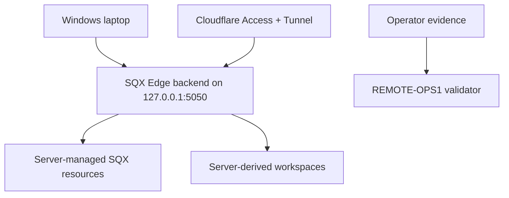

# REMOTE-OPS1 - Laptop Production Readiness Drill

REMOTE-OPS1 verifies that the Windows laptop can behave like the controlled production host before any new tester, buyer or traffic movement is executed. It does not invite users, create grants, send emails, publish URLs, create checkout links or expand access.

Contract version: `remote-ops1-laptop-readiness-v1`.

The purpose is to prove the real operating path:



## Local Evidence Rule

Raw readiness evidence must live only under ignored local paths:

- `.local/remote_service/remote_ops1_laptop_readiness.local.json`
- `.local/remote_service/remote_ops1_laptop_readiness/`

Tracked docs may contain only schema examples, validator contracts and public-safe summaries. Never commit:

- protected URLs;
- Cloudflare account, tunnel, Access app or policy identifiers;
- operator/tester/customer emails;
- local SQX paths;
- `data.db` paths;
- workspace roots;
- screenshots with provider details;
- secrets, cookies, tokens or grant keys.

## Operator Drill

1. Review Windows power settings:

```powershell
powercfg /query
```

Confirm sleep/hibernation will not interrupt the pilot window.

2. Run strict REMOTE-1 preflight:

```powershell
powershell -NoProfile -ExecutionPolicy Bypass -File tools\remote_service_preflight.ps1 -RequireSqxReady
```

3. Run one-shot watchdog smoke:

```powershell
powershell -NoProfile -ExecutionPolicy Bypass -File tools\remote_service_watchdog.ps1 -Once -NoStart
```

4. Start or confirm backend local health:

```powershell
powershell -NoProfile -ExecutionPolicy Bypass -File tools\remote_service_start_server.ps1
```

Then check `http://127.0.0.1:5050/api/health` locally.

5. Confirm Cloudflare Tunnel and Access readiness with private evidence only:

```powershell
powershell -NoProfile -ExecutionPolicy Bypass -File tools\remote_tunnel_operator_handoff.ps1 -CloudflaredPath C:\Tools\cloudflared\cloudflared.exe
powershell -NoProfile -ExecutionPolicy Bypass -File tools\remote_tunnel_preflight.ps1 -RequireEvidence
powershell -NoProfile -ExecutionPolicy Bypass -File tools\remote_tunnel_smoke.ps1 -ProtectedUrl "<private protected url>"
```

The handoff writes `.local/remote_service/cloudflare_tunnel_operator_handoff.local.md` and starts from `docs/examples/cloudflared-config.local.example.yml` as the safe placeholder shape for the ignored real tunnel config.

6. Smoke app-level login, workspace, artifact generation/export, revocation and restore using private local notes only.

7. Copy the example:

```powershell
Copy-Item docs\examples\remote_ops1_laptop_readiness.local.example.json `
  .local\remote_service\remote_ops1_laptop_readiness.local.json
```

8. Fill booleans and private refs locally. Do not paste real private values into tracked files.

9. Validate:

```powershell
python backend\sqx-edge-tool\tools\remote_ops1_laptop_readiness.py `
  --evidence .local\remote_service\remote_ops1_laptop_readiness.local.json `
  --out-dir .local\remote_service\remote_ops1_laptop_readiness
```

The public-safe output is:

- `.local/remote_service/remote_ops1_laptop_readiness/remote_ops1_laptop_readiness.public.json`

## Required Checks

The private evidence must confirm:

- `powerPlanReviewed`
- `sleepDisabled`
- `rebootRecoveryPlanReady`
- `remoteServicePreflightStrictGo`
- `watchdogSmokeGo`
- `backendLocalHealthGo`
- `backendBoundToLocalhostOnly`
- `sqxPathsReady`
- `sqxDataDbReady`
- `templatesReady`
- `outputWritable`
- `workspaceRootReady`
- `cloudflaredInstalled`
- `tunnelPreflightGo`
- `tunnelStartupPlanReady`
- `accessAnonymousBlocked`
- `appSessionSmokeReady`
- `workspaceSmokeReady`
- `artifactGenerationSmokeReady`
- `revocationSmokeReady`
- `restorePlanReady`
- `logsWrittenToIgnoredLocalPath`
- `privateEvidenceStoredOutsideGit`
- `noSecretsInGitConfirmed`
- `noRouterPortsOpened`
- `noUsersInvited`

## Risk Metrics Must Stay Zero

- `newUsersInvited`
- `paidUsersActivated`
- `testerGrantsChanged`
- `checkoutLinksCreated`
- `emailsSent`
- `publicUrlsShared`
- `routerPortsOpened`
- `automationJobsStarted`
- `unresolvedSupportIssues`
- `workspaceLeakIncidents`
- `securityIncidents`
- `tunnelDropsDuringSmoke`
- `backendHealthFailures`
- `artifactGenerationFailures`
- `revocationFailures`

## Decisions

- `GO_REMOTE_OPS1_LAPTOP_READY`: the laptop is ready to proceed to private REMOTE-8H package evidence.
- `NO_GO_REMOTE_OPS1_LAPTOP_READINESS_BLOCKED`: one or more checks or zero-risk metrics are not clean.
- `NO_GO_REMOTE_OPS1_LAPTOP_READINESS_EVIDENCE_MISSING`: private local readiness evidence has not been provided yet.
- `NO_GO_REMOTE_OPS1_PUBLIC_SUMMARY_PRIVACY_LEAK`: the public summary leaked a private URL, local path, email, Cloudflare identifier or secret marker.

Even on GO:

- `readiness.executionAllowedNow = false`
- `readiness.userExpansionAllowedNow = false`
- `readiness.requiresRemote8hEvidenceBeforeMovement = true`

## Next Phase

After GO, the next safe step is `REMOTE-8H private package evidence` if the operator decides to package exactly one next controlled movement. Any execution still requires REMOTE-8I approval and later manual records.
